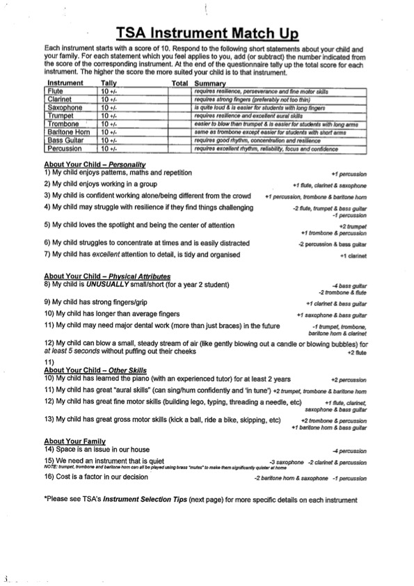

# Instrument Quiz

This quiz was built to assist with a common dilemma faced by parents wanting their child to learn a musical instrument, which instrument should they choose?

## A Bit of Background

When I'm not coding I work for a company in Sydney that provides music tuition to schools across the city. Towards the end of 2023 they approached me and asked if I could create this quiz based on a pdf that they had been circulating to parents who were looking for guidance on instrument selection:

I know, just looking at it gives me a headache!

## Planning

Despite the paper quiz's unappealing presentation it did have all the necessary logic required for the game meaning I could focus on the front end and performance of the app.

I knew I wanted the application to be fast, fun and as a lightweight as possible. With this in mind I decided to build my first Svelte/Sveltekit application. I also decided I would integrate the GSAP library to provide animations.

## Building

Using Svelte was a breeze! I can see why so many developers love it. For a project of this size I haven't come across a better alernative. The performance speaks for itself:

## Thoughts on Svelte

Whilst I loved using Svelte for a project of this size I could imagine it being limiting when it comes to its single component architecture. It was easier in React to create a component in one file with the option to later refactor that component into smaller components for re-use within the application. My impression of Svelte is that this wouldn't be as easy to achieve.

# Future Updates

During development I decided I wanted the quiz results to be shareable so parents could share their results between each other. To achieve this I passed the results of the quiz into the URL before rendering the results to the page meaning sharing those results would be as easy as sharing the URL of the results page.

After doing this it occured to me that I could have used the URL for the entire quiz state rather than using Svelte stores. This would also have allowed people to use browser navigation to navigate backwards on quiz questions if they changed their mind. More importantly it would remove that painful moment when you try to navigate backwards only to realise you have to start the quiz from the beginning again! I may look at implementing this in the future.

# Credits

### CODE BASE

| ROLE       | CONTRIBUTOR                 |
| ---------- | --------------------------- |
| Developer  | Alex Slater                 |
| Quiz Logic | Teaching Services Australia |

### IMAGES FROM FLATICON

| IMAGE         | SOURCE                                                         |
| ------------- | -------------------------------------------------------------- |
| Saxophone     | [Freepik](https://www.flaticon.com/free-icons/saxophone)       |
| Bass Guitar   | [Freepik](https://www.flaticon.com/free-icons/bass-guitar)     |
| Baritone Horn | [Freepik](https://www.flaticon.com/free-icons/tuba)            |
| Clarinet      | [Freepik](https://www.flaticon.com/free-icons/clarinet)        |
| Flute         | [Freepik](https://www.flaticon.com/free-icons/flute)           |
| Percussion    | [Freepik](https://www.flaticon.com/free-icons/drum)            |
| Trombone      | [Nikita Golubev](https://www.flaticon.com/free-icons/trombone) |
| Trumpet       | [Freepik](https://www.flaticon.com/free-icons/trumpet)         |
